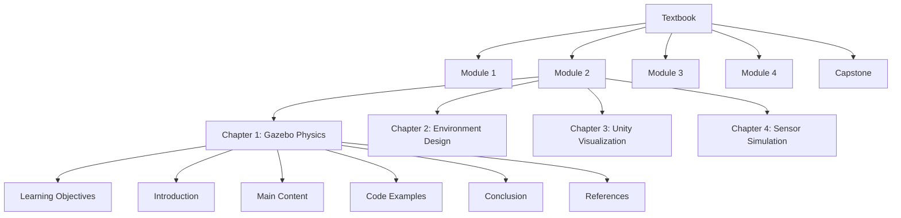

# Data Model: Textbook Content Structure

This document defines the data model for the textbook content, which is represented as a structured hierarchy of Markdown files.

## 1. Top-Level Structure

The textbook is organized into modules, and each module is a collection of chapters.

- **Textbook**
  - **Module 1**: The Robotic Nervous System (ROS 2)
  - **Module 2**: The Digital Twin (Gazebo & Unity)
  - **Module 3**: The AI-Robot Brain (NVIDIA Isaac)
  - **Module 4**: Vision-Language-Action (VLA)
  - **Capstone Project**: The Autonomous Humanoid

## 2. Module Structure

Each module is a directory containing a set of chapter files.

- **Module Directory (`/docs/<module-name>/`)**
  - `_category_.json`: Docusaurus file to define the module's sidebar label and position.
  - `ch01-<chapter-title>.md`: Markdown file for the first chapter.
  - `ch02-<chapter-title>.md`: Markdown file for the second chapter.
  - ... and so on.

## 3. Chapter Structure (`.md` file)

Each chapter is a Markdown file with a consistent structure.

- **Front Matter**: YAML metadata at the top of the file.
  - `id`: A unique identifier for the chapter.
  - `title`: The full title of the chapter.
  - `description`: A brief summary of the chapter's content.
  - `tags`: A list of keywords related to the chapter.
- **Chapter Content**:
  - **Learning Objectives**: A bulleted list of what the reader will be able to do after completing the chapter.
  - **Introduction**: A brief overview of the chapter's topics.
  - **Main Content Sections**: The body of the chapter, divided into logical sections with H2 and H3 headings.
  - **Code Examples**: Runnable code snippets with explanations.
  - **Interactive Examples (Future)**: Embedded React components for interactive learning experiences.
  - **Conclusion**: A summary of the key takeaways.
  - **References**: A list of all cited sources in APA 7th edition format.

## 4. Entity Relationship Diagram (Conceptual)

This diagram illustrates the conceptual relationship between the different content entities.

