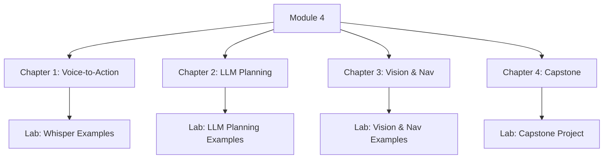

# Data Model: Module 4 Content Structure

This document defines the data model for the content of Module 4, which is represented as a structured hierarchy of Markdown files.

## 1. Top-Level Structure

- **Textbook**
  - ...
  - **Module 4**: Vision-Language-Action (VLA)
  - ...

## 2. Module Structure

- **Module Directory (`/docs/module4/`)**
  - `_category_.json`
  - `ch01-voice-to-action.md`
  - `ch02-llm-cognitive-planning.md`
  - `ch03-vision-and-navigation.md`
  - `ch04-capstone-autonomous-humanoid.md`

## 3. Chapter Structure (`.md` file)

- **Front Matter**: YAML metadata.
- **Chapter Content**:
  - Learning Objectives
  - Introduction
  - Main Content Sections
  - Code Examples
  - Conclusion
  - References

## 4. Lab & Code Structure (`/labs/module4/`)

- **`whisper_examples/`**: ROS 2 package for Whisper integration.
- **`llm_planning_examples/`**: ROS 2 package for LLM-based cognitive planning.
- **`vision_navigation_examples/`**: ROS 2 package for vision and navigation.
- **`capstone_project/`**: ROS 2 package for the capstone project.

## 5. Entity Relationship Diagram (Conceptual)

