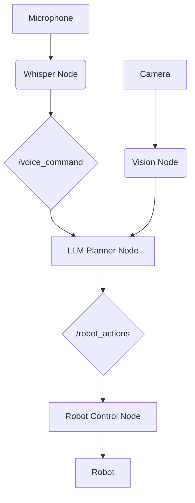

# Research: Vision-Language-Action (VLA) Module

This document summarizes the research findings for building the "Vision-Language-Action (VLA) Module".

## 1. OpenAI Whisper for Voice-to-Action

**Decision**: We will use OpenAI's Whisper model for speech-to-text transcription.

**Rationale**:

*   **High Accuracy**: Whisper is a state-of-the-art speech recognition model with high accuracy for a wide range of audio inputs.
*   **Ease of Use**: The `openai` Python library provides a simple interface for interacting with the Whisper API.
*   **ROS 2 Integration**: It can be integrated into a ROS 2 node to process audio data from a microphone and publish the transcribed text.

**Implementation Plan**:

1.  **Microphone Input Node**: Create a ROS 2 node that uses the `pyaudio` library to capture audio from a microphone and publish it to an `/audio/raw` topic as `audio_common_msgs/msg/AudioData` messages.
2.  **Whisper Transcription Node**: Create a second ROS 2 node that subscribes to the `/audio/raw` topic. This node will accumulate the audio data into a temporary audio file, send it to the Whisper API for transcription, and then publish the transcribed text to a `/voice_command` topic as a `std_msgs/String` message.

## 2. LLMs for Cognitive Planning in ROS 2

**Decision**: We will use a Large Language Model (LLM) to translate natural language commands into a sequence of ROS 2 actions.

**Rationale**:

*   **Natural Language Understanding**: LLMs are capable of understanding the intent behind natural language commands and generating a sequence of logical actions.
*   **Flexibility**: This approach allows for more flexible and complex commands than simple keyword matching.
*   **ROS 2 Integration**: An LLM can be integrated into a ROS 2 node that subscribes to the `/voice_command` topic, sends the text to the LLM for planning, and then publishes the resulting actions to the appropriate ROS 2 topics.

**Implementation Plan**:

1.  **Command Parser Node**: Create a ROS 2 node that subscribes to the `/voice_command` topic.
2.  **LLM Integration**: Use a library like `langchain` or `openai` to send the transcribed text to an LLM (e.g., GPT-4) with a carefully crafted prompt that instructs it to generate a sequence of ROS 2 actions.
3.  **Action Publisher**: Parse the LLM's response and publish the actions to the relevant ROS 2 topics (e.g., `/cmd_vel`, `/navigate_to_pose`).

## 3. Integrating Vision and Navigation for Autonomous Humanoids

**Decision**: We will use the Nav2 stack for high-level path planning and integrate it with vision-based perception.

**Rationale**:

*   **Industry Standard**: Nav2 is the standard navigation stack in ROS 2.
*   **Extensibility**: Nav2's plugin-based architecture allows for customization.
*   **Vision Integration**: It can be integrated with vision-based perception pipelines for object detection and obstacle avoidance.

**Implementation Plan**:

1.  **Vision Node**: Create a ROS 2 node that uses a pre-trained object detection model (e.g., YOLO) to identify objects in the environment.
2.  **Navigation Goal Publisher**: The LLM-based planner will generate navigation goals based on the user's command and the output of the vision node.
3.  **Nav2 Integration**: The navigation goals will be sent to the Nav2 stack to generate a path and control the robot.

## 4. End-to-End VLA Pipeline

**Decision**: We will build an end-to-end VLA pipeline that integrates the above components.

**Rationale**:

*   This will provide a complete and functional system that can take a voice command, understand it, and execute it in a simulated environment.
*   The capstone project will demonstrate the capabilities of the VLA pipeline with a simulated autonomous humanoid.

**High-Level Architecture**:

